# RepoLens

**AI-powered codebase intelligence.** Paste a public GitHub URL, get a navigable model of how the
repository actually works: architecture layers, traced workflows, the API surface, the data model,
the dependency graph, quality signals and a grounded Q&A that cites the files it read.

RepoLens is not a GitHub viewer. The pipeline downloads the source through the GitHub API, parses
every supported file with tree-sitter (plus Python's AST), resolves imports and calls across files,
builds a graph, detects routes, models, queries and workflows, embeds code chunks, and stores all of
it in Postgres/pgvector keyed by analysis. The dashboard then queries those artefacts — nothing on
screen is invented, and anything heuristic is labelled as such.

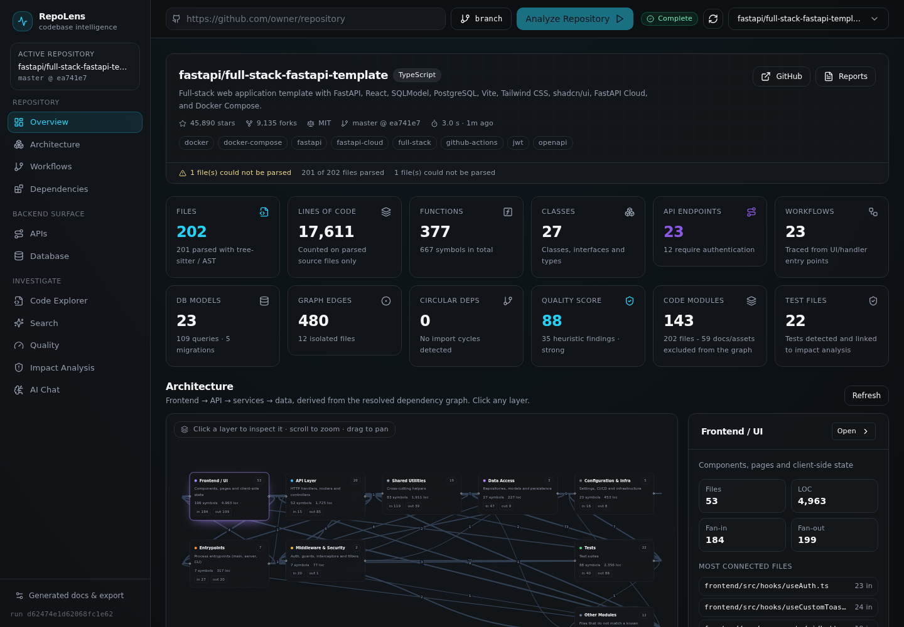

---

## What it looks like

| | |
|---|---|
| **Overview** — repo header, KPI cards, architecture graph, AI insights, recent runs |  |
| **Architecture** — layer graph (frontend → API → services → data) with per-layer detail | 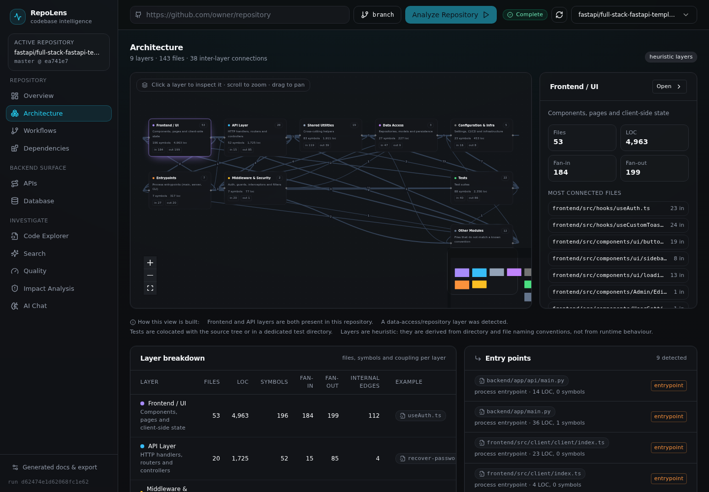 |
| **Workflows** — auto-traced flows with step and swimlane sequence views | 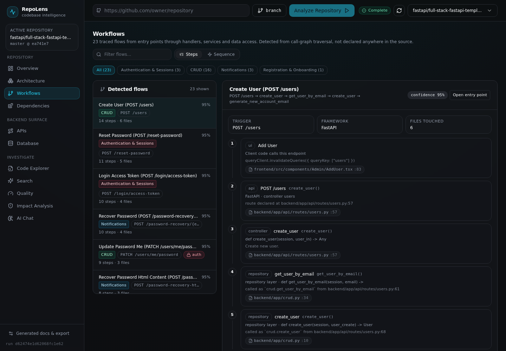 |
| **Dependencies** — code-module graph, cycles, hubs, isolated modules, scope note | 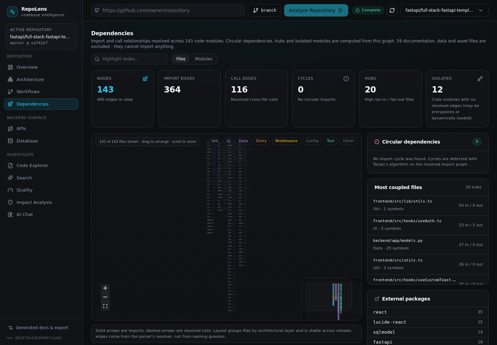 |
| **APIs** — method, path, handler, service, auth, provenance badges, source filter | 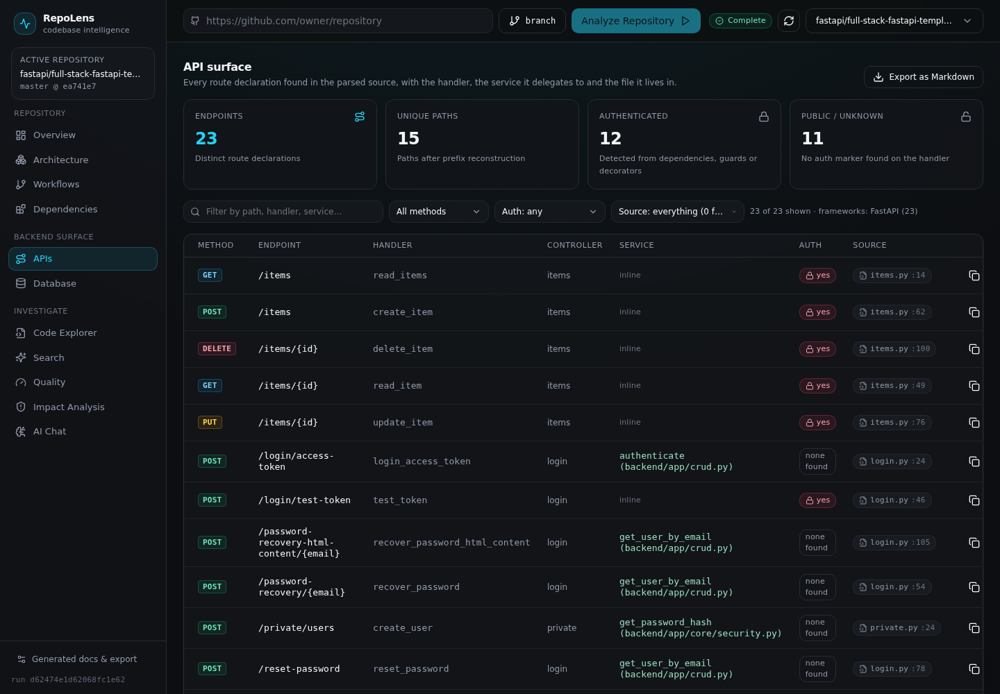 |
| **Database** — ER diagram, models, fields, migrations, query inventory | 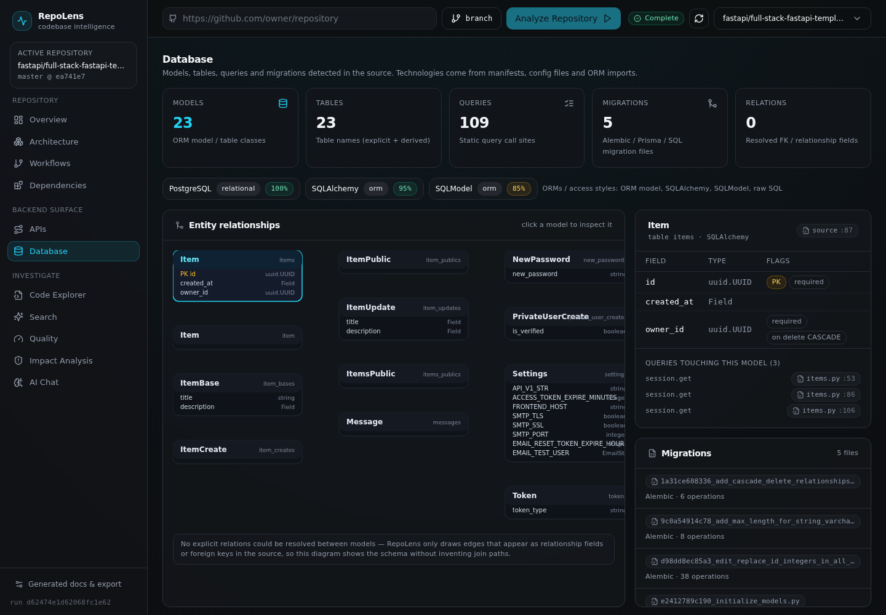 |
| **Code Explorer** — Monaco with symbol intelligence and jump-to-file | 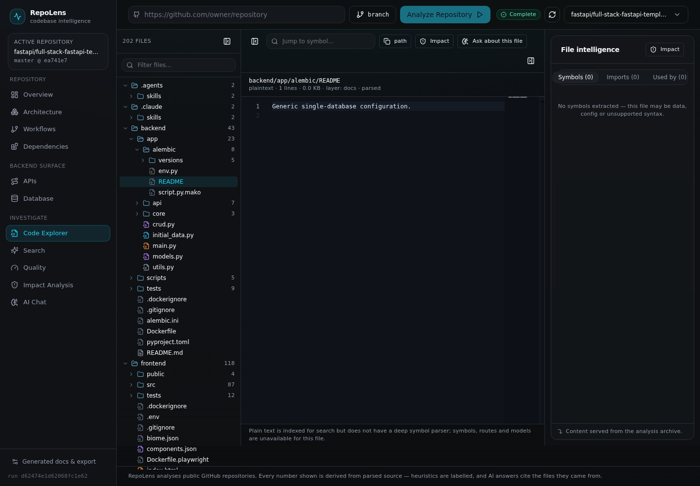 |
| **Quality** — complexity, coupling, cycles, duplication, missing tests (heuristics) | 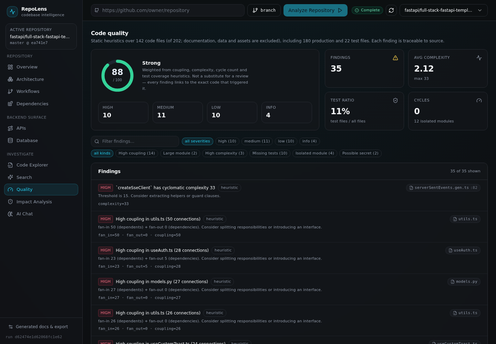 |
| **Impact Analysis** — dependents, affected endpoints/workflows, related tests, risks | 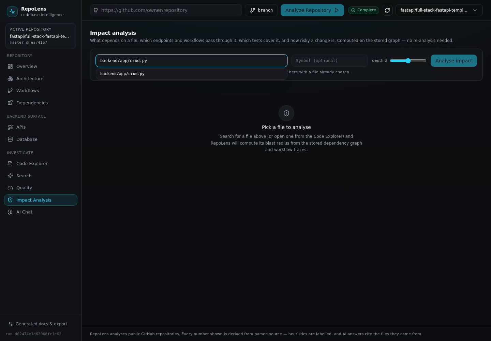 |
| **AI Chat** — grounded answers with traced chains and citations | 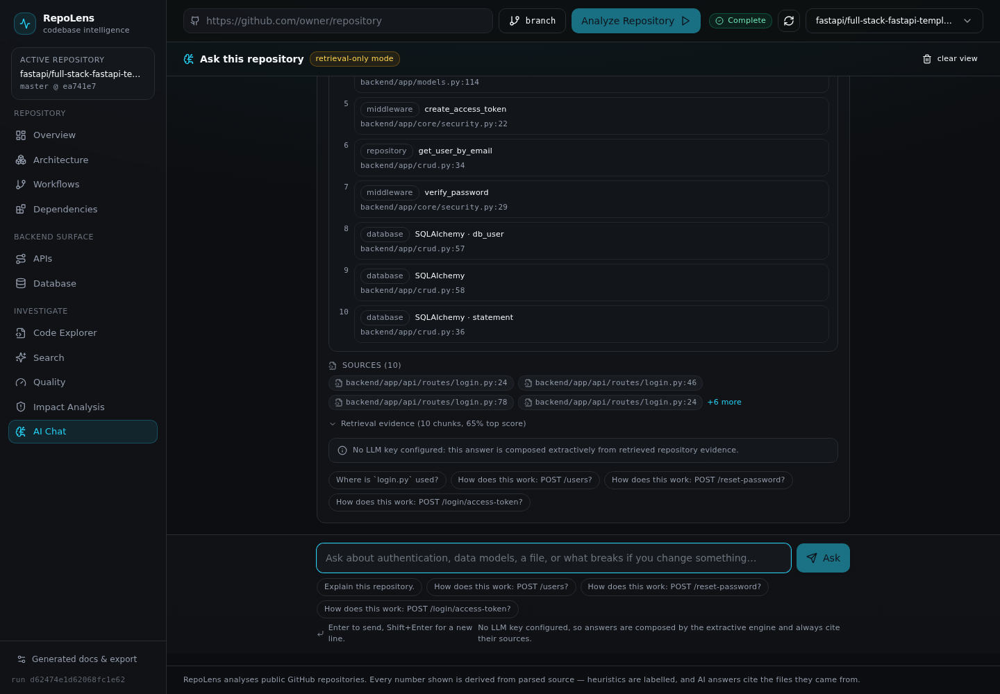 |
| **Search** — semantic + exact text search over the indexed snapshot | 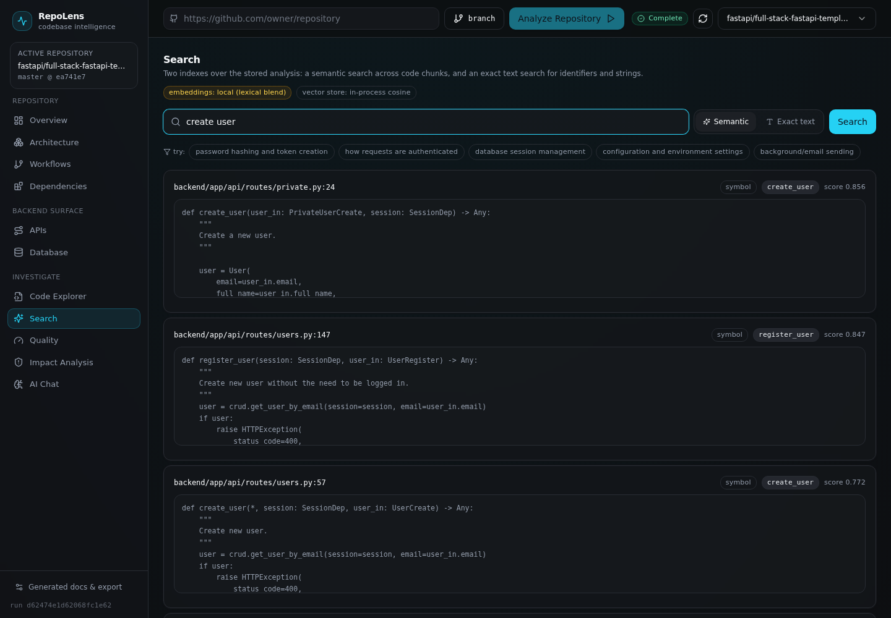 |
| **Reports** — generated README/API/onboarding docs and full JSON export | 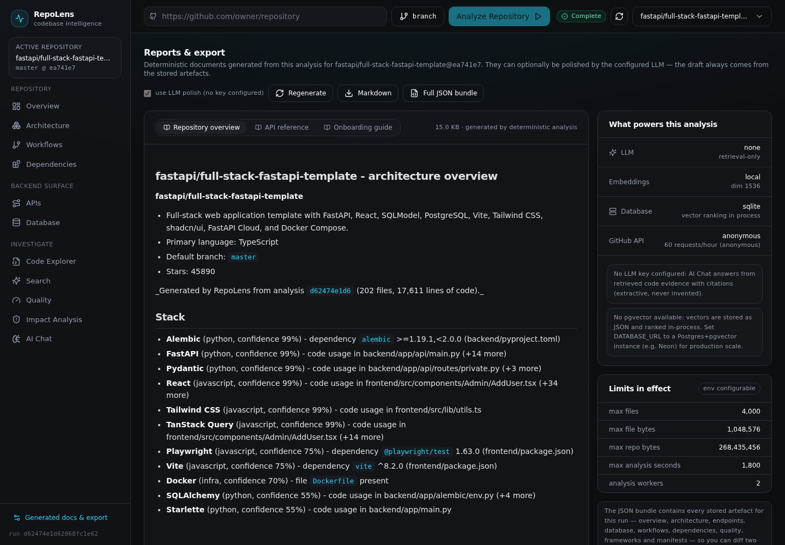 |
| **Library repos** — no route declarations means no invented API surface | 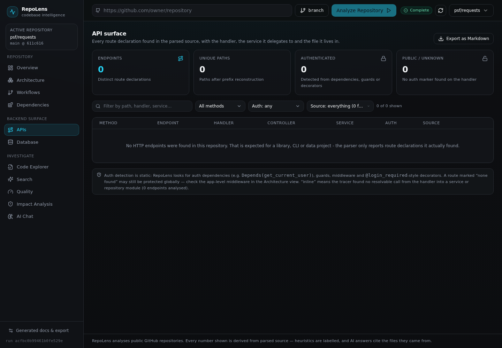 |

*(Screenshots come from real runs: `fastapi/full-stack-fastapi-template` — 202 files, 143 code modules,
480 resolved edges, 12 isolated modules, 23 endpoints, 23 workflows, 35 heuristic findings, health 88 —
and `pallets/flask` — 217 files, 79 code modules, 1 circular dependency, 1 isolated module, 33 endpoints
(all from example/test apps), 26 workflows, health 91. The `*-flask.png` captures show the second
repository, where provenance badges and scope notes are most visible.)*

---

## Quick start (local, SQLite)

```bash
git clone <this repo> repolens && cd repolens

# 1. Python packages + API
python -m venv .venv && source .venv/bin/activate
pip install -e packages/shared -e packages/parser -e packages/graph -e packages/embeddings -e apps/api

# 2. configuration
cp .env.example .env            # SQLite by default; add GITHUB_TOKEN / LLM keys when you have them

# 3. run the API
cd apps/api && REPOLENS_DATA_DIR=../../data python -m uvicorn app.main:app --port 8000

# 4. run the web app (second terminal)
cd apps/web && npm install
API_INTERNAL_URL=http://127.0.0.1:8000 npm run dev     # http://localhost:3000
```

Then paste `https://github.com/fastapi/full-stack-fastapi-template` into the header and press
**Analyze Repository**.

## Quick start (Docker, Postgres + pgvector)

```bash
cp .env.example .env            # optionally set GITHUB_TOKEN, OPENAI_API_KEY, POSTGRES_PASSWORD
docker compose -f infrastructure/docker-compose.yml up --build
# migrate (one-shot) → api → web ; UI on http://localhost:3000, API on http://localhost:8000
```

The compose file lives at `infrastructure/docker-compose.yml`; a copy of the same stack is kept at
the repository root for convenience. `docker compose up` starts Postgres 16 + pgvector, applies
`infrastructure/migrations/*.sql`, then boots the API and the Next.js server (which proxies
`/backend/*` to the API server-side, so the browser only ever talks to one origin).

---

## How an analysis runs

```
GitHub URL ──▶ validate + metadata (GitHub API)
            ──▶ download tarball (bucket for the selected branch) ──▶ extract
            ──▶ walk files (limits, ignores, binary/large skip)
            ──▶ parse each file      tree-sitter for 20+ languages, Python AST for .py
                                     └─ per-file failures are warnings, never fatal
            ──▶ resolve imports      internal / external / unresolved, router prefixes
            ──▶ build graph          code-module nodes, import + call edges, cycles, hubs
            ──▶ detect               frameworks, endpoints, DB models/queries, layers
            ──▶ trace workflows      from routes/handlers/UI entry points through services to data
            ──▶ quality + insights   complexity, coupling, duplication, missing tests
            ──▶ embed chunks         local hashing model or OpenAI; pgvector or in-process
            ──▶ persist             19 tables keyed by analysis_id  ──▶ dashboard / chat / export
```

Every stage reports progress and is cancellable; each artefact is stored so the UI never re-analyses
to answer a question. Re-running the same repository creates a *new* analysis (the previous 8 runs per
repository are kept and switchable), which is what makes "what changed between runs" possible later.

### Scope rules (what is *not* counted)

Analysis is deliberately scoped so the numbers describe the code, not the repository's furniture:

* **Documentation and assets stay out of the graph.** Only files that can carry dependencies become
  graph nodes (tree-sitter languages plus `.vue`/`.svelte`); `docs/`, `.rst`, Markdown, data and image
  files are indexed and searchable but never counted as "isolated modules" or "hubs". The Dependencies
  page reports how many files were excluded (`graph_stats.excluded_files`).
* **Endpoints are deduplicated by `method + path`.** When the same URL is declared in several files the
  application's own declaration wins and every other declaration is kept in `declarations[]` with an
  `is_example` / `is_test` flag, so a library repository (Flask, requests) honestly reports "33
  endpoints, all declared in example or test applications" instead of inventing an API surface.
* **Workflows are scoped the same way** (`scope: application | example | test`, plus a `scope_note`),
  and a URL inside a tutorial is never mistaken for a client call site.
* **Language coverage is complete.** Common non-code extensions (`.rst`, `.txt`, `.toml`, `.ini`,
  `.bat`, `.svg`, certs, dotfiles, `Dockerfile`, `Makefile`) are labelled rather than lumped into
  "Other" - on `pallets/flask` that moved 104 files / 15,334 LOC out of "unknown", and the Languages
  card dims entries that are indexed for search but not parsed.

### Grounding rules

* Counts, paths, line numbers, endpoints, models and workflows come from parser output — never from
  an LLM.
* Detections carry `confidence` and `evidence[]`; quality findings are marked `heuristic: true`;
  traces flag `trace_truncated` when static resolution ran out of road.
* Chat answers are assembled from retrieved evidence; with no LLM key configured the extractive
  engine still answers and cites, and the UI says so (`retrieval-only mode`).
* Impact analysis runs on the *stored* graph — same numbers whether you ask in the UI or in chat.

---

## Repository layout

```
repolens/
├── apps/
│   ├── api/                        FastAPI service
│   │   └── app/
│   │       ├── api/                routes: system, repos, analyses, insights, chat
│   │       ├── analyzers/          endpoints, database, insights, docs, pipeline
│   │       ├── ai/                 llm client, tracer, grounded chat
│   │       ├── core/               config, db, logging, errors, capabilities
│   │       ├── models/tables.py    19 tables (analysis-scoped ids)
│   │       ├── services/           github, store, search, analysis manager, impact
│   │       └── migrations.py       schema bootstrap + SQL migration runner
│   └── web/                        Next.js 15 + Tailwind + shadcn-style UI
│       ├── app/                    one route per product area
│       ├── components/             ui primitives, architecture/workflow graphs, explorer, chat
│       └── lib/                    typed API client, hooks, types, formatters
├── packages/
│   ├── shared/                     constants (stages, language maps, thresholds), schemas, errors
│   ├── parser/                     tree-sitter + Python AST analyzers, resolvers, framework detection
│   ├── graph/                      dependency graph, layers, workflow tracer, impact, quality
│   └── embeddings/                 embedder (local/openai) + vector store
├── infrastructure/
│   ├── docker/                     api.Dockerfile, web.Dockerfile
│   ├── migrations/                 pgvector + views SQL
│   └── docker-compose.yml          db + migrate + api + web
├── docs/                           ARCHITECTURE.md, API.md, DEVELOPMENT.md, DEPLOYMENT.md
├── .env.example                    every knob, documented
└── README.md
```

---

## Feature status

Everything listed here is implemented and exercised against real repositories. Nothing is a mock.

| Area | Status |
|---|---|
| Repo import: URL validation, metadata, branch selection, progress, cancel, delete | ✅ |
| Overview: languages, frameworks, counts, DB tech, deps, status, insights, recent runs | ✅ |
| Architecture: React Flow layer graph, zoom/pan/click, per-layer files & connections | ✅ |
| Workflows: categories, step view, sequence view, confidence, evidence, scope badges, jump-to-source | ✅ |
| Dependencies: file/module views, import + call edges, cycles, hubs, isolated modules | ✅ |
| APIs: method/path/handler/controller/service/auth, provenance badges, source filter, evidence, Markdown export | ✅ |
| Database: technologies, ER diagram, models+fields, migrations, query inventory | ✅ |
| Code Explorer: Monaco, file tree, symbol jump, references, imports/dependents, impact link | ✅ |
| AI Chat: grounded answers, traced chains, citations, retrieval evidence, follow-ups | ✅ (LLM or extractive) |
| Impact Analysis: dependents, transitive reach, affected endpoints/workflows, tests, risks | ✅ |
| Quality: complexity, coupling, cycles, large modules, duplication, missing tests | ✅ (heuristics, labelled) |
| Reports: README / API / onboarding documents + full JSON bundle export | ✅ |
| Semantic search (pgvector or in-process) and exact text search | ✅ |
| Not implemented | notifications and PR/branch diffing; the UI states this rather than pretending |

## Configuration

All configuration is environment-driven — see [`.env.example`](.env.example) for every variable
(`DATABASE_URL`, `ENABLE_PGVECTOR`, `EMBEDDING_DIM`, `GITHUB_TOKEN`, `LLM_PROVIDER`, `LLM_MODEL`,
`OPENAI_API_KEY`, `ANTHROPIC_API_KEY`, `EMBEDDINGS_PROVIDER`, `MAX_FILES`, `MAX_FILE_BYTES`,
`MAX_REPO_BYTES`, `MAX_ANALYSIS_SECONDS`, `ANALYSIS_WORKERS`, `CORS_ORIGINS`,
`API_INTERNAL_URL`, `NEXT_PUBLIC_API_BASE`). No secret is ever hardcoded, and
`GET /api/system/capabilities` reports what the running service actually has available.

## Documentation

* [`docs/ARCHITECTURE.md`](docs/ARCHITECTURE.md) — pipeline, data model, algorithms, design decisions
* [`docs/API.md`](docs/API.md) — every endpoint with request/response shapes and error envelopes
* [`docs/DEVELOPMENT.md`](docs/DEVELOPMENT.md) — local setup, tests, conventions, troubleshooting
* [`docs/DEPLOYMENT.md`](docs/DEPLOYMENT.md) — Docker, Neon, pgvector, scaling and operations

## Archive contents

If you received this as `RepoLens-complete.zip`, unzip it and follow *Quick start* above. The archive
contains the full source tree (apps, packages, infrastructure, docs, screenshots) but excludes
generated artefacts — `node_modules/`, `.next/`, `.venv/`, `__pycache__/`, `*.egg-info/` and the
runtime `data/` directory — so run `npm install` and create the virtualenv once after extracting:

```bash
unzip RepoLens-complete.zip && cd repolens
python -m venv .venv && source .venv/bin/activate
pip install -e packages/shared -e packages/parser -e packages/graph -e packages/embeddings -e apps/api
(cd apps/web && npm install)
```

## Limits and honesty notes

* Static analysis cannot see dynamic dispatch, DI containers, string-based routing or reflection;
  every view says where its knowledge stops (`trace_truncated`, `notes`, `evidence`).
* Layers are derived from path conventions and resolvable edges. They are marked *heuristic*.
* Language support is deepest for Python, TypeScript/JavaScript/TSX, Go, Java, Ruby, PHP, Rust, C#,
  C/C++, and Vue/Svelte; SQL, Prisma, GraphQL, Proto, YAML/JSON/TOML/INI, Markdown, reStructuredText,
  shell, Dockerfiles and Makefiles are indexed (searchable) but not parsed into symbols.
* Verified on three real repositories (same pipeline, no configuration):
  * `fastapi/full-stack-fastapi-template` — 202 files, 143 code modules (59 docs/assets excluded),
    480 import/call edges, 12 isolated modules, 0 cycles, 23 endpoints, 23 workflows, health 88.
  * `pallets/flask` — 217 files, 79 code modules (138 excluded), 254 edges, 1 isolated module,
    1 circular dependency, 33 endpoints *(14 example + 19 test — the library ships no server of its own)*,
    26 workflows (12 example + 14 test), health 91.
  * `psf/requests` — 101 files, 35 code modules (66 excluded), 148 edges, 0 endpoints and 0 workflows
    — correct for a library, and the UI says so instead of guessing a surface.
* Language labelling is complete on all three: zero files fall into "Other" (they were 104 files /
  15,334 LOC on Flask and 20 files on requests before the lookup was made name-aware).
* Large repositories are bounded by the limits above; truncated graphs and skipped files are
  reported in the UI instead of silently dropping data.
